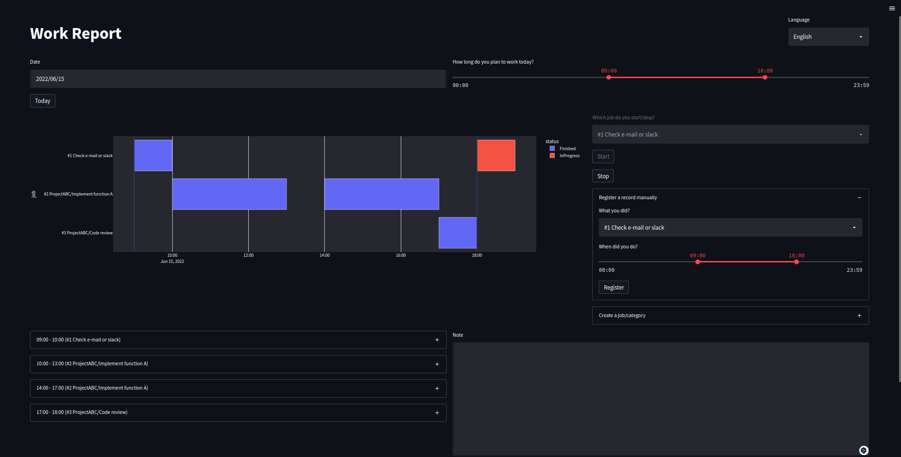

# personal-work-report

[](https://www.python.org/downloads/release/python-3911/)


Time-based work report application for personal with streamlit.



## Getting Started

### Prerequisites

- [pyenv]: Python Version Management
- [poetry]: Dependency Management for Python
- make: Build tool
- Web browser

### Installing

```bash
# install python 3.10.5 with pyenv
$ pyenv install 3.10.5

# install dependencies
$ poetry install

# [Optional] activate virtual environment
$ source .venv/bin/activate
```

### How to run

```bash
$ make run

  You can now view your Streamlit app in your browser.

  Local URL: http://localhost:8501
  Network URL: http://XXX.XXX.XXX.XXX:8501
```

## Built With

- [streamlit]: The fastest way to build and share data apps.
- [plotly.py]: An interactive, open-source, and browser-based graphing library for Python  
- [pydantic]: Data validation and settings management using Python type hints

[pyenv]: https://github.com/pyenv/pyenv
[poetry]: https://github.com/python-poetry/poetry
[pydantic]: https://github.com/samuelcolvin/pydantic
[streamlit]: https://github.com/streamlit/streamlit
[plotly.py]: https://github.com/plotly/plotly.py